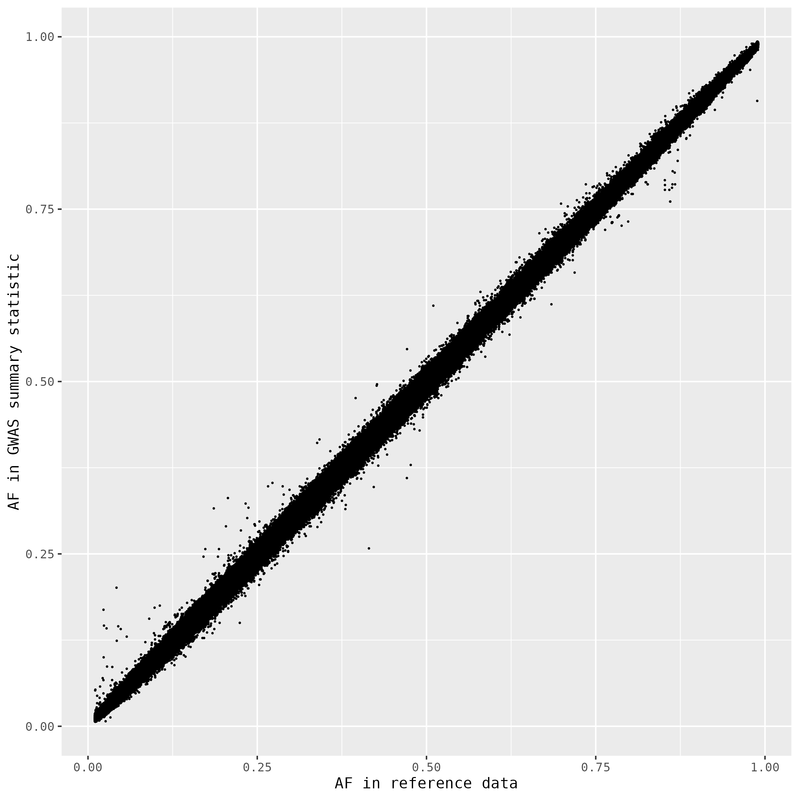
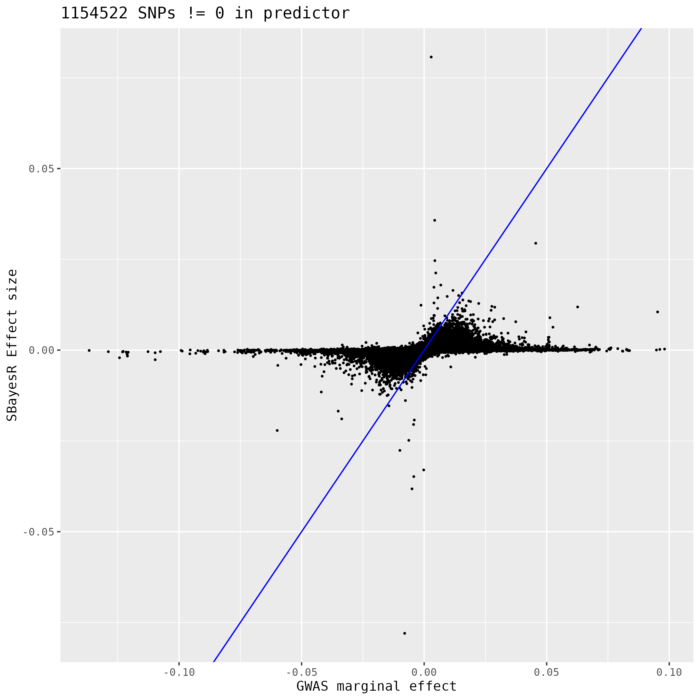

# SBayesRC_pipeline
This is a pipeline how I use SBayesRC method to generate predictor

## define path and input/out 

```{bash, eval = F}
cd $workingpath

## this is where you placed file cojo_format_v3.R
exedir="./"

## this is where you placed LD files and annotation file. They are available for downloading from GCTB website:
## https://cnsgenomics.com/software/gctb/#Download

LD_PATH1="/scratch/project_mnt/S0007/uqzzhen4/project/UKB/LD/ukb20k_7M_4cM/"
LD_PATH2="/scratch/project_mnt/S0007/uqzzhen4/project/UKB/LD/ukb20k_hm3_4cM/"
annot="/scratch/project_mnt/S0007/uqzzhen4/project/UKB/annot/annot_baseline2.2.txt" # annottion file

## you can put your GWAS file into a folder and name it with the trait
trait=MDD_01
gwas_file=PGC_UKB_depression_genome-wide.txt
```


## format to cojo

for example, if the raw gwas file has a header like this:

> MarkerName A1 A2 Freq LogOR StdErrLogOR P

you can put each element of the header name into the script per flag:

```{bash, eval = F}
cmd1="Rscript  ${exedir}/cojo_format_v3.R  \
  --file  ${trait}/${gwas_file}  \
  --out  ${trait}/${gwas_file}.ma   \
  --SNP  MarkerName  \
  --A1 A1  \
  --A2  A2 \
  --freq  Freq   \
  --pvalue P  \
  --beta  LogOR  \
  --se  StdErrLogOR   \
  --samplesize  500199   "

job_name="format_"${trait}
formatqsub=`qsubshcom  "$cmd1" 1 50G  $job_name  2:00:00  " "     `
```

This R script has several extra functions than formatting:
> 1. Convert odds ratio to effect size if it's named OR.
> 2. Make a allele frequency comparison plot between data vs LD reference
> 3. If allele frequency is missing in your data, it fills it with the AF in LD reference.
> 4. If there is not a column of per-SNP-sample-size in your data, you can fill it with a unique number.
> 5. If your data has two columns for the sample size as Ncase and Ncontrol, the script adds them up to be N. Put them in as "Ncase,Ncontrol" behind --samplesize. 
 
As an exmple:




## check up

I had problem when meta analyzed file have SNPs with less information than others. Reading the file in R will end in the middle and lose SNPs.

```{bash, eval = F}
## check number of rows

n_formatted=$(wc -l  ${trait}/${gwas_file}.ma  | awk '{print $1}'  )
n_raw=$(wc -l   ${trait}/${gwas_file}  | awk '{print $1}' )

if [ $n_formatted != $n_raw ] 
then 
	echo "formatted file could be truncated, or losing SNPs that don't have allele frequency. Check out."
fi
```


## Tidy: optional step, tidy summary data

```{bash, eval = F}
ma_file=${trait}/${gwas_file}

## "log2file=TRUE" means the messages will be redirected to a log file 
job_name="tidy_"${trait} # your job name, customize
tidyqsub=`qsubshcom "Rscript -e \"SBayesRC::tidy(mafile='${ma_file}.ma', LDdir='$LD_PATH1', output='${ma_file}_tidy.ma', log2file=TRUE) \"" 1 50G $job_name 10:00:00 "  -wait=$formatqsub  " `
 
```

Best practice: read the log to check issues in your GWAS summary data.  

## choose LD matrix 

We don't want to impute more than 30% SNPs in the LD matrix. If you GWAS summary stat has less than 70% of the SNPs in the 7.3M LD reference, we will switch to the HapMap3 reference. 

```{bash, eval = F}
n_QCed=$(wc -l  ${trait}/${gwas_file}_tidy.ma  | awk '{print $1}'  )

if [ $n_QCed > 5149563 ]
then
        LD_PATH=$LD_PATH1
else
        LD_PATH=$LD_PATH2
fi
```

## Impute: optional step if your summary data doesn't cover the SNP panel

```{bash, eval = F}
job_name="imputation_"${trait}  # customize
imputesub=`qsubshcom "Rscript -e \"SBayesRC::impute(mafile='${ma_file}_tidy.ma', LDdir='$LD_PATH', output='${ma_file}_imp.ma', log2file=TRUE) \"" 4 150G $job_name 12:00:00 " -wait=$tidyqsub  "   `
```


## SBayesRC: main function for SBayesRC

```{bash, eval = F}
job_name="sbr_eig_"${trait}
sbrcsub=`qsubshcom "Rscript -e \"SBayesRC::sbayesrc(mafile='${ma_file}_imp.ma', LDdir='$LD_PATH', outPrefix='${ma_file}_sbrc', annot='$annot', log2file=TRUE) \"" 10 150G $job_name 25:00:00 " -wait=$imputesub " `
```

## plot SBayesRC effect size

At last we compare the marginal effect size with the effect size from SBayesRC with a simple plot. 

```{bash, eval = F}
plotcmd=" Rscript  ${exedir}/effect_size_plot.R  $trait   $gwas_file "
jobname="effect_plot_"${trait}
plotsub=`qsubshcom "$plotcmd"  1  50G  $jobname  1:00:00  " -wait=$sbrcsub  " `
```

As an example:



## Useful links:

GCTB:  
> https://cnsgenomics.com/software/gctb/#Download  

SBayesRC:  
> https://github.com/zhilizheng/SBayesRC  

qsubshcom:  
> https://github.com/zhilizheng/qsubshcom  


