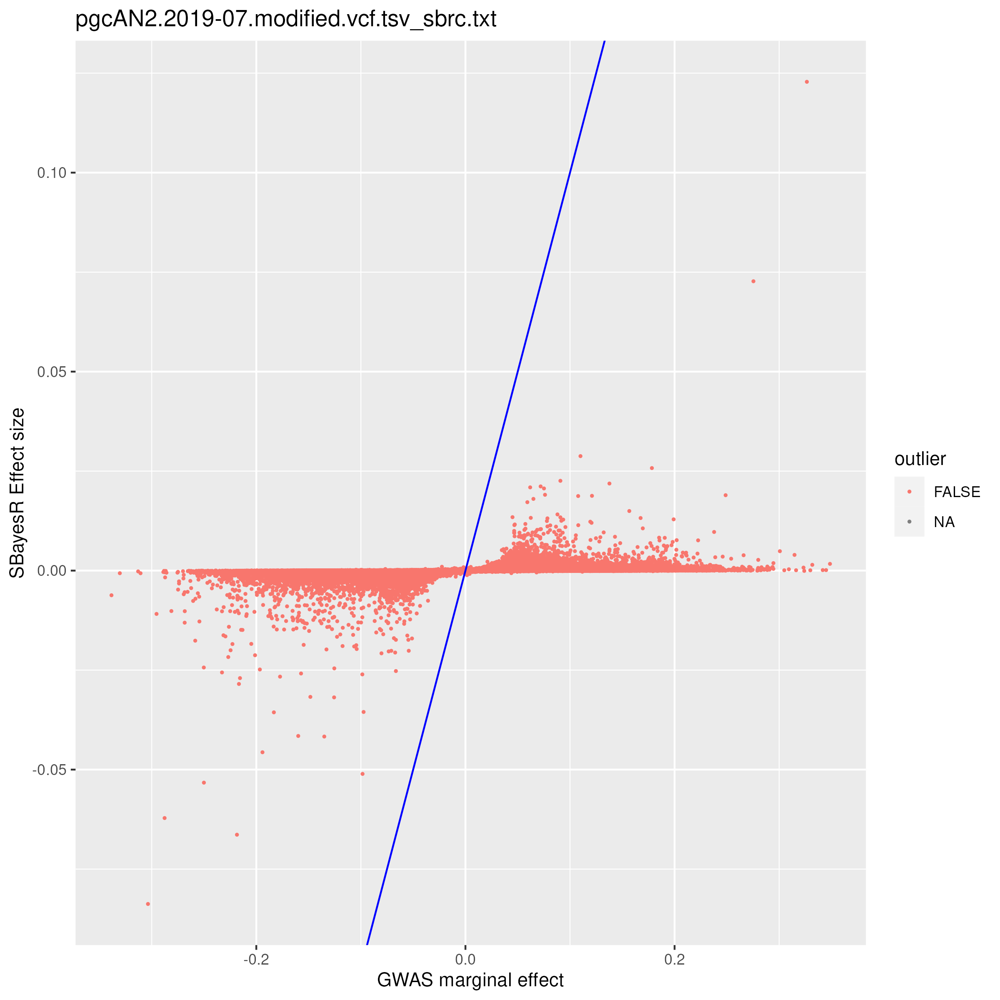

This is a pipeline how I format any GWAS summary-level data into cojo format, and use SBayesRC method to generate predictors. 
We also included example code to run SBayesR, SBayesS, COJO and clumping on this page. 


# Preparation

Resource data is available for local users with the following path setting, and public for [downloading](https://cnsgenomics.com/software/gctb/#Download) too. 

```{bash, eval = F}
cd $workingpath

## this is where you placed file cojo_format_v7.R
exedir="./"

## this is where you placed LD files and annotation file. They are available for downloading from GCTB website:
## https://cnsgenomics.com/software/gctb/#Download
annot="/QRISdata/Q6913/Pipeline/annot_baseline2.2.txt" # annottion file
ldm1=/QRISdata/Q3895/ldm/eigen/ukbEUR_Imputed/
ldm2=/QRISdata/Q3895/ldm/eigen/ukbEUR_HM3/

## choose the LD reference based on number of SNPs in GWAS data. 
if [ $(wc -l  ${trait}/${gwas_file}  | awk '{print $1}'  ) -gt  5149563 ]; then   ldm=$ldm1 ; else  ldm=$ldm2; fi

```

For a neat organization, you can put your GWAS file into a folder and name it with the trait. All the outputs of following analysis will be put into the same folder. 
Several sub-folders will be set for different analysis. 

```{bash, eval = F}
trait=MDD_01
gwas_file=PGC_UKB_depression_genome-wide.txt
ma_file=${trait}/${gwas_file}

mkdir ${trait}/COJO ${trait}/COJO_imp ${trait}/CplusT ${trait}/SBayesR ${trait}/SBayesS  ${trait}/SBayesRC
mkdir ${trait}/SBayesRC/GCTB_v2.5.2 

echo " there are " $(wc -l  ${trait}/${gwas_file} | awk '{print $1}' ) "SNPs in the original GWAS data"
```


# format a GWAS summary level data to cojo format

for example, if the raw gwas file has a header like this:

> MarkerName A1 A2 Freq LogOR StdErrLogOR P

you can put each element of the header name into the script per flag:

```{bash, eval = F}
cmd1="Rscript  ${exedir}/cojo_format_v7.R  \
  --file  ${trait}/${gwas_file}  \
  --out  ${trait}/${gwas_file}.ma   \
  --SNP  MarkerName  \
  --A1 A1  \
  --A2  A2 \
  --freq  Freq   \
  --pvalue P  \
  --beta  LogOR  \
  --se  StdErrLogOR   \
  --samplesize  500199   "

job_name="format_"${trait}
formatqsub=`qsubshcom  "$cmd1" 1 50G  $job_name  2:00:00  " "     `
```

This R script has several extra functions than formatting:
> 1. If dbSNP ID is missing, and chr and bp are provided. We will denote the SNP column name as "missing", and match to the dbSNP IDs using the snp.info file in LD reference.
> 2. If the alleles are in lower case, it converts them to uppercase.
> 3. Convert odds ratio to effect size if it's named OR.
> 4. Make a allele frequency comparison plot between data vs LD reference if it is provided
> 5. If allele frequency is missing, it fills it with the AF in LD reference.
> 6. If there is not a column of per-SNP-sample-size in raw data, the script can fill it with a unique number found in publication.
> 7. If the data has two columns for the sample size as Ncase and Ncontrol, the script adds them up to be N. Put them in as "Ncase,Ncontrol" behind --samplesize.
> 8. Allele frequency is also sometimes separately included for cases and controls. If that’s the case, we will do a calculation with the number of cases and controls.
> 9. If the data does not have sample size but "NCHROBS", it will be divided by 2 to be sample size.
> 10. If SE is missing, we will estimate it from BETA and P.
> 11. If beta is missing but z is provided, we will calculate effect size with z score, allele frequency and sample size. 

This is an exmple of comparison of allele frequency in gwas summary data vs. reference data:


# SBayesRC

The method is implemented into GCTB. 

## QC and Impute: GCTB does the two things in one step.

```{bash, eval = F}
job_name="imputation_"${trait}  
imputesub=`qsubshcom "gctb --ldm-eigen $ldm --gwas-summary ${ma_file}.ma --impute-summary --out ${ma_file}_imp.ma --thread 4"  4 150G $job_name 12:00:00 " -wait=$impqsub  "   `
```

## SBayesRC

```{bash, eval = F}
job_name="sbrc_"${trait}  

sbrc_gctb_sub=`qsubshcom "./gctb_2.5.2_Linux/gctb   \
--sbayes RC  \
--ldm-eigen   ${ldm}   \
--gwas-summary   ${ma_file}_imp.ma.imputed.ma   \
--annot  $annot  \
--out  ${trait}/SBayesRC/GCTB_v2.5.2/${gwas_file}_imp.ma.imputed_sbrc_gctb   \
--thread 10 "  10 150G $job_name 24:00:00 " -wait=$gctbimputesub"   `

```

## plot effect size vs. marginal effect size

At last we compare the marginal effect size with the effect size from SBayesRC with a simple plot. 

```{bash, eval = F}
plotcmd=" Rscript  ${exedir}/effect_size_plot_for_GCTB_output.R    $trait   ${gwas_file}_imp.ma.imputed.ma    ${trait}/SBayesRC/GCTB_v2.5.2/${gwas_file}_imp.ma.imputed_sbrc_gctb   "
jobname="effect_plot_"${trait}
plotsub=`qsubshcom "$plotcmd"  1  50G  $jobname  1:00:00  " -wait=$sbrc_gctb_sub  " `
```

As an example:



# Clumping

Clumping plus threshold method could be used as a baseline model to compare the prediction accuracy.

```{bash, eval = F}
snps2exclude=2_duplicated_SNPs_to_exclude.txt          

clmp_sub=`qsubshcom "plink --bfile UKB_20k/PLINK/ukbEURu_imp_chr{TASK_ID}_v3_impQC_20k \
  --exclude $snps2exclude \
  --clump ${trait}/${gwas_file}.ma \
  --clump-p1 0.05  \
  --clump-p2 0.05  \
  --clump-r2 0.1 \
  --clump-kb 500 \
  --clump-field "p" \
  --out ${trait}/CplusT/${gwas_file}_chr{TASK_ID}_clumped   "  10 150G "clumping" 24:00:00 "  -wait=$formatqsub  -array=1-22 "   `
                
```

# COJO
We can run COJO to see how many significant and independent SNP signal were in the data. 

```{bash, eval = F}
cojo_sub=`qsubshcom "gcta-1.94.1  \
--bfile   UKB_20k/PLINK/ukbEURu_imp_chr{TASK_ID}_v3_impQC_20k \
--chr   {TASK_ID} \
--cojo-file   ${trait}/${gwas_file}.ma  \
--cojo-slct  \
--out  ${trait}/COJO/${trait}_chr{TASK_ID}_cojo  "  10 150G "COJO"  24:00:00 "  -wait=$formatqsub  -array=1-22 "   `
```

# SBayesR


```{bash, eval =F}
sbr_gctb_sub=`qsubshcom "gctb  --sbayes R  \
--ldm-eigen  ${ldm} \
--gwas-summary  ${trait}/${gwas_file}_imp.ma.imputed.ma  \
--chain-length 5000 --burn-in 2000   --no-mcmc-bin   \
--out  ${trait}/SBayesR/${trait}_SBayesR_eigen  --thread 10 "  10 150G  "SBayesR" 24:00:00 " -wait=$gctbimputesub"   `
```

# SBayesS

```{bash, eval =F}
sbs_gctb_sub=`qsubshcom "gctb  --sbayes S  \
--ldm-eigen  ${ldm} \
--gwas-summary ${trait}/${gwas_file}_imp.ma.imputed.ma  \
--chain-length 5000 --burn-in 2000 --num-chains 3  --no-mcmc-bin   \
--out  ${trait}/SBayesS/${trait}_SBayesS_eigen --thread 10 "  10 150G "SBayesS" 24:00:00 " -wait=$gctbimputesub"   `

```


# Useful links:

GCTB:  
> https://cnsgenomics.com/software/gctb/#SBayesRCTutorial

R version SBayesRC:  
The same SBayesRC methods is also available in an R version, which is well explained at Zhili's Github.
Although the output files appear in different format as the GCTB version, and the content of output are different, the core computation is the same. 

> https://github.com/zhilizheng/SBayesRC  

qsubshcom:  
> https://github.com/zhilizheng/qsubshcom

COJO:
> https://yanglab.westlake.edu.cn/software/gcta/#COJO

Clump:
> https://zzz.bwh.harvard.edu/plink/clump.shtml


